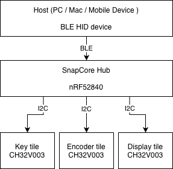

# Magnetile Hardware

**Open source modular wireless macropad system**

---

Magnetile is a modular wireless input device. A central hub connects to interchangeable input tiles — mechanical keys, rotary encoders, sliders, display keys — via magnetic pogo pin connectors. The hub presents as a single BLE HID device to the host. Everything is open source.

> **Personal project by a maker in Bavaria, Germany. Not for commercial sale.**

---

## System Overview

Tiles are hot-swappable modules. Each tile has its own small MCU communicating over I²C. The hub aggregates all input and handles the BLE stack. A single LiPo cell in the hub powers the entire system through the pogo pins.

---

## SnapCore Hub Board

The SnapCore is the first hardware in this repository — the nRF52840-based hub PCB.

### Hardware Stack

| Component | Part | Notes |
|-----------|------|-------|
| MCU | Nordic nRF52840 (AQFN-73) | BLE 5, USB, 1MB flash, 256KB RAM |
| LDO | XC6220B331MR-G (Torex, SOT-23-5) | 3.3V, 1A, ~8µA quiescent |
| Battery charger | TP4056 | Single-cell LiPo, ~300mA charge rate |
| USB | USB-C, 5.1kΩ CC pull-downs | Power delivery only (rev 1) |
| HF crystal | 32 MHz | nRF52840 system clock |
| RTC crystal | 32.768 kHz | Low-power RTC |
| QSPI flash | W25Q128 (16 MB) | DNP rev 1, footprint reserved |
| Antenna | PCB trace (meander) | SWRA117D reference, tunable RF matching |
| Tile bus | I²C with 4.7kΩ pull-ups | Pogo pin connector |

### PCB Stackup

| Layer | Function |
|-------|----------|
| F.Cu | Components + signals |
| In1.Cu | Solid GND plane |
| In2.Cu | Power distribution + overflow signals |
| B.Cu | Signals |

- All vias: 0.6mm outer / 0.3mm drill, F.Cu to B.Cu
- GND stitching vias every ~7mm
- ENIG finish
- Copper pour excluded from antenna area

---

## Tile Architecture

Tiles are designed to be cheap and simple. The hub owns the BLE stack; tiles just report their input state over I²C when polled.

**Tile MCU target:** CH32V003 (RISC-V, I²C slave)

Each tile exposes:
- I²C slave address (configurable per tile type)
- Input state register (key states, encoder delta, slider position)
- Optional: small display framebuffer via I²C (for display tiles)

The pogo pin connector carries: `VCC`, `GND`, `SDA`, `SCL`, and an optional `INT` line for event-driven wake.

Full tile specification in [`docs/connector-pinout.md`](docs/Pinout.svg).

---

## Software

Firmware lives in the companion repository: [magnetile-firmware](https://github.com/magnetile/magnetile-firmware)

| Component | Stack |
|-----------|-------|
| RTOS | Zephyr / Nordic NCS |
| BLE profile | HID over GATT |
| Wireless config | Web Bluetooth API (browser-based) |
| Debug | RTT (Segger J-Link / nRF9160 DK) |
| Hub–tile protocol | I²C polling, CH32V003 slave firmware |

---

## Status

| Milestone | Status |
|-----------|--------|
| Schematic rev 1 | ✅ Complete |
| PCB layout rev 1 | ✅ Complete |
| Fab files (JLCPCB) | 🔄 In progress |
| Rev 1 bring-up | ⏳ Pending |
| Tile hardware | ⏳ Rev 2 |
| Firmware (hub) | 🔄 In progress |
| Tile firmware | ⏳ Rev 2 |
| Web config UI | ⏳ Planned |

---

## Building / Ordering

All design files are in KiCad 9. Fab outputs (Gerbers, BOM, CPL) for JLCPCB are in `snapcore/fab/`.

**Preferred suppliers:** JLCPCB (PCB + assembly), LCSC (components).

---

## License

Hardware design files are licensed under **CERN Open Hardware Licence Version 2 – Strongly Reciprocal (CERN-OHL-S v2)**.

See [`LICENSE`](LICENSE) for the full text.

---

## Contributing

This is a personal project in active development. Issues and suggestions are welcome. See [`CONTRIBUTING.md`](CONTRIBUTING.md) before opening a pull request.

---

Made in Bavaria · nRF52840 · KiCad · Zephyr

